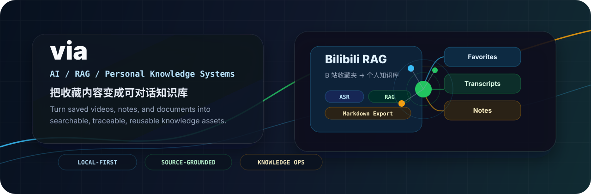
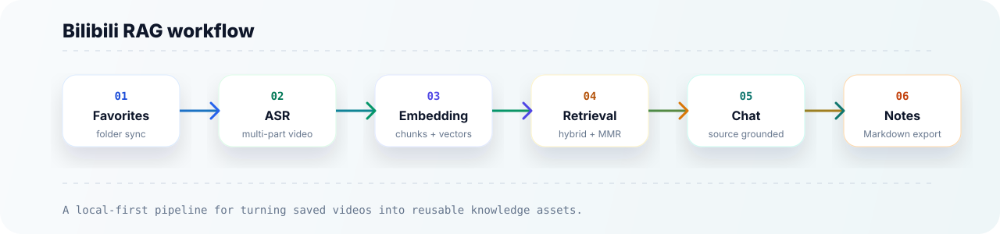
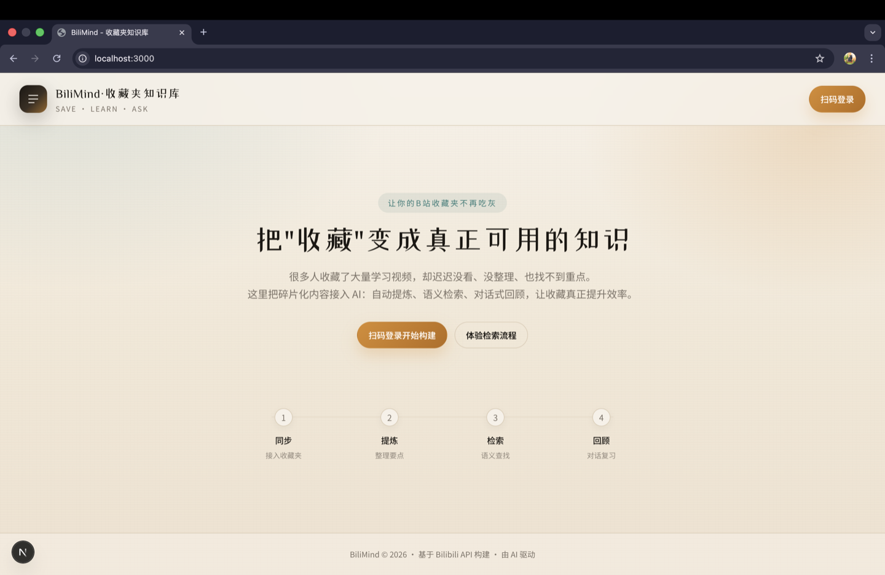
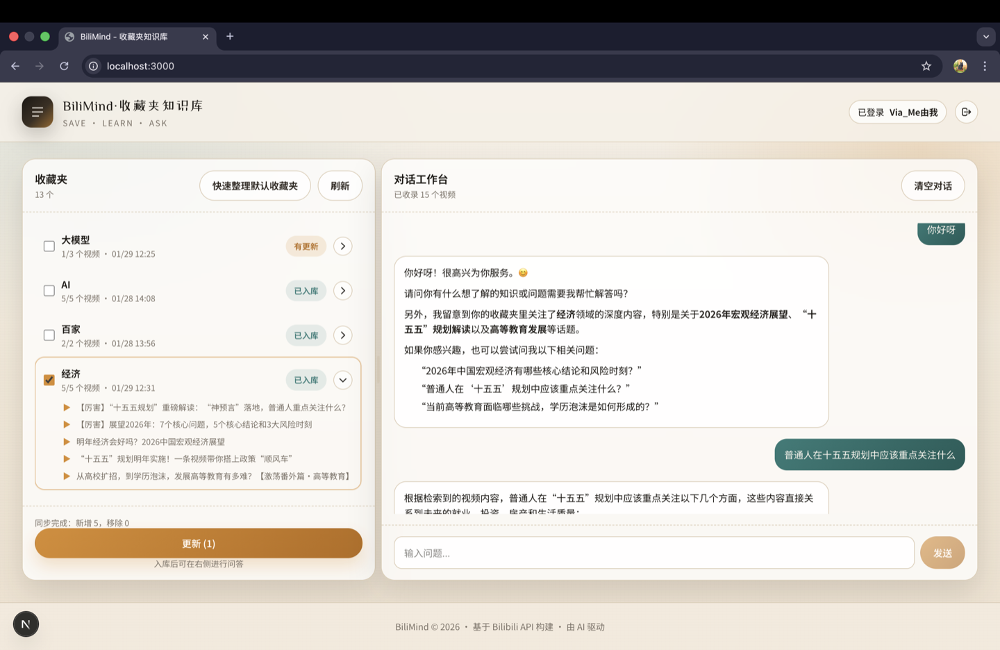

 

  

 

**AI / RAG / 个人知识系统 / 开源工具** 
把视频、文档和零散信息整理成可检索、可追溯、可复用的知识库。 
Turning videos, documents, and scattered notes into searchable, traceable, reusable knowledge bases.

---

## 主项目 | Featured Product

<table>
  <tr>
    <td width="50%">
      <h3><a href="https://github.com/via007/bilibili-rag">Bilibili RAG</a></h3>
      

        把 B 站收藏夹变成可对话、可检索、可导出笔记的个人知识库。
      

      

        Turn Bilibili favorite folders into a searchable, source-traceable personal knowledge base with RAG chat and Markdown export.
      

      

        <strong>适合：</strong>课程、访谈、演讲、播客式视频、技术学习资料。 
        <strong>Best for:</strong> courses, interviews, talks, podcast-style videos, and technical learning archives.
      

      

        <a href="https://github.com/via007/bilibili-rag/blob/main/README.md">中文 README</a>
        |
        <a href="https://github.com/via007/bilibili-rag/blob/main/README_EN.md">English README</a>
        |
        <a href="https://github.com/via007/bilibili-rag">Repository</a>
      

    </td>
    <td width="50%">
      <table>
        <tr>
          <td><strong>Input</strong></td>
          <td>Bilibili favorites / videos</td>
        </tr>
        <tr>
          <td><strong>Pipeline</strong></td>
          <td>ASR -> Embedding -> Retrieval -> RAG</td>
        </tr>
        <tr>
          <td><strong>Output</strong></td>
          <td>Traceable answers + Markdown notes</td>
        </tr>
        <tr>
          <td><strong>Stack</strong></td>
          <td>FastAPI, Next.js, ChromaDB, SQLite, Docker</td>
        </tr>
      </table>
    </td>
  </tr>
</table>

## 工作流 | Workflow

## 产品截图 | Product Screenshots

<table>
  <tr>
    <td width="50%">
      
       
      收藏夹同步与知识库入口 | Favorite-folder sync and knowledge-base entry
    </td>
    <td width="50%">
      
       
      可追溯来源的 RAG 对话 | Source-traceable RAG chat
    </td>
  </tr>
</table>

## 我关注什么 | What I Build

| 方向 | 中文 | English |
| --- | --- | --- |
| RAG | 检索、召回、重排、来源追溯 | Retrieval, recall, reranking, source attribution |
| 个人知识库 | 视频、文档、笔记入库与复用 | Video, document, and note ingestion |
| LLM 应用 | 面向真实工作流的 AI 工具 | Practical AI apps for real workflows |
| 本地优先 | 可本地运行、可检查、可部署 | Local-first, inspectable, deployable tools |
| 中文内容智能 | 长视频、课程、访谈整理 | Chinese long-form video and learning-content workflows |

## 精选项目 | Selected Work

| Project | 中文说明 | English |
| --- | --- | --- |
| [bilibili-rag](https://github.com/via007/bilibili-rag) | B 站收藏夹 RAG 知识库 | Bilibili favorites to RAG knowledge base |
| [graphrag-Chinese-llm](https://github.com/via007/graphrag-Chinese-llm) | GraphRAG 中文优化探索 | Chinese-oriented GraphRAG exploration |
| [pandas-ai-excel](https://github.com/via007/pandas-ai-excel) | AI 辅助 Excel / 表格分析 | AI-assisted spreadsheet analysis |
| [electrical-ai-fault-diagnosis](https://github.com/via007/electrical-ai-fault-diagnosis) | 电气设备故障诊断与维修建议 | AI fault diagnosis and repair suggestions |

## 技术栈 | Toolkit

  
  
  
  
  
  
  
  
  
  

| Backend | AI / RAG | Frontend | Data / Infra |
| --- | --- | --- | --- |
| Python | LangChain | Next.js | SQLite |
| FastAPI | ChromaDB | TypeScript | Docker |
| AsyncIO | Embeddings | React | Local deployment |
| Uvicorn | ASR | Tailwind CSS | GitHub Actions |

## 最近关注 | Current Interests

- 如何让个人收藏、课程、访谈、播客不再吃灰
- 如何提升真实内容库里的 RAG 召回质量
- 如何让 AI 回答保留清晰来源，而不是只给结论
- 如何把长视频内容整理成可复习、可导出、可二次利用的笔记

Current interests:

- Making saved content useful again
- Improving retrieval quality for real personal content libraries
- Keeping RAG answers grounded with clear source attribution
- Turning long-form videos into reusable notes and knowledge assets

## 联系 | Contact

- GitHub: [@via007](https://github.com/via007)
- Email: `he_via@163.com`
- Location: Shanghai, China

---

**把内容变成知识，把知识变成可行动的工具。** 
Turning content into knowledge, and knowledge into useful tools.

